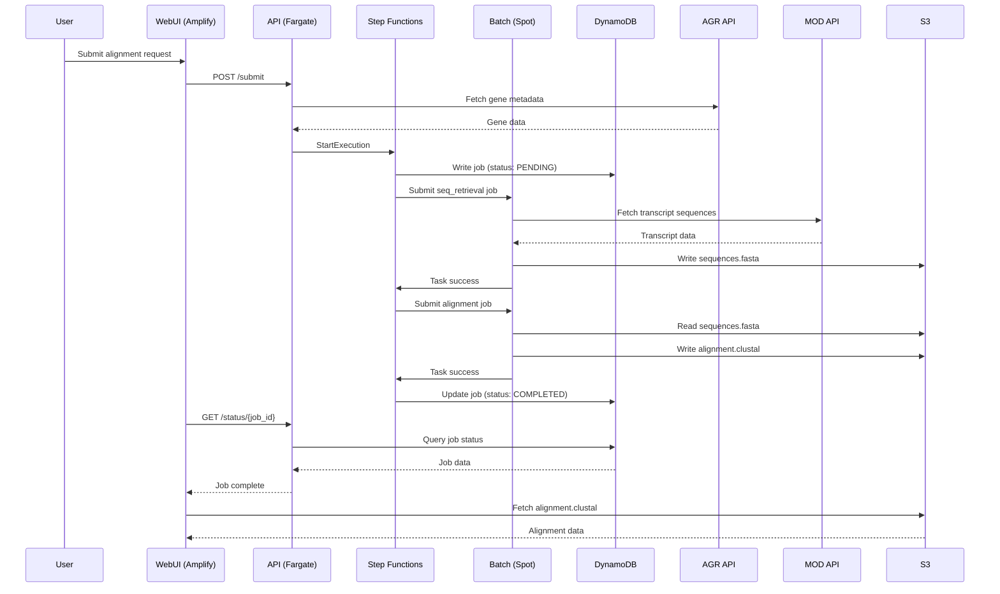
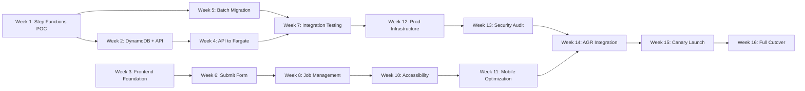
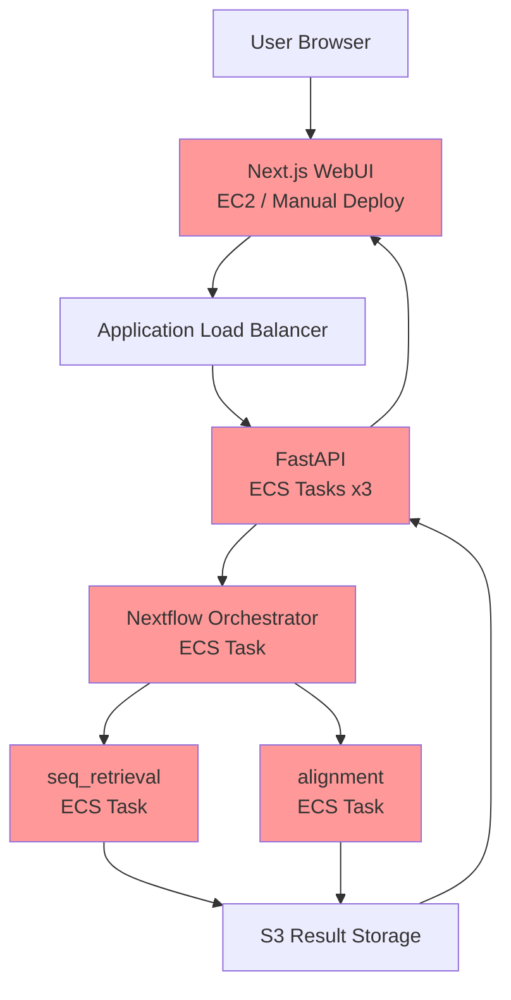
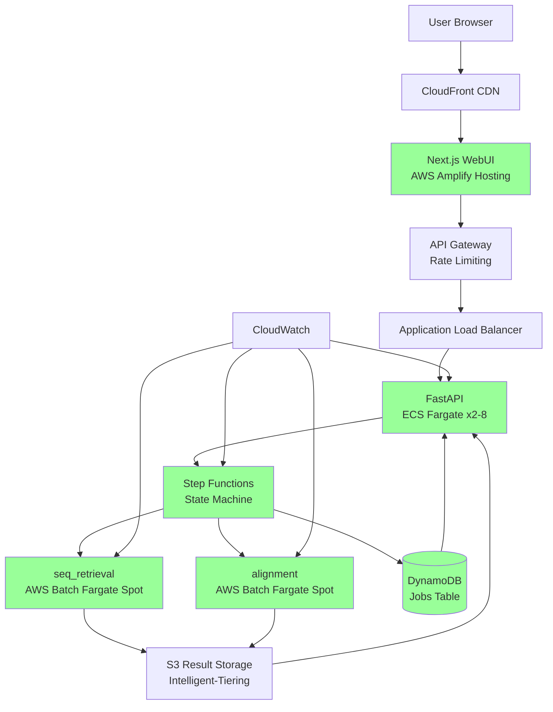
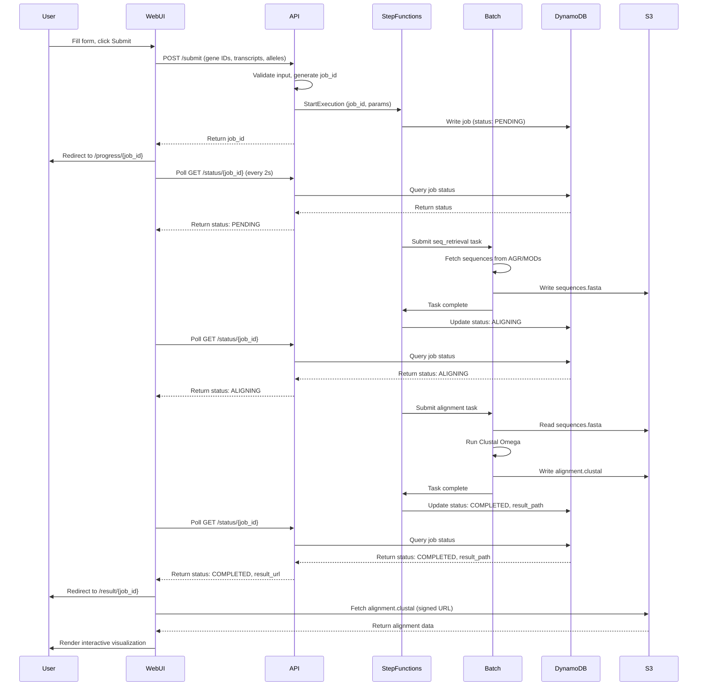

# Product Requirements Document: PAVI Public Launch
## Unified Infrastructure Modernization & User Experience Enhancement

**Document Version:** 1.0
**Date:** 2025-12-23
**Status:** Draft - For Review
**Author:** PAVI Product Team
**Target Release:** Q2 2025 (16-week timeline)

---

## 1. Context & Why Now

**Market Timing & Strategic Drivers**

- **Alliance Genome readiness for public tools**: Alliance infrastructure is mature enough to support public-facing bioinformatics tools with production SLOs
- **Research community demand**: Protein variant analysis tools with intuitive visualization are scarce; PAVI fills a critical gap for comparative genomics researchers
- **Technical debt plateau**: Current Nextflow-on-ECS architecture is reaching cost and scalability limits; migration now prevents future technical bankruptcy
- **Competitive positioning**: Public launch establishes Alliance as provider of production-grade, accessible bioinformatics tools beyond static data resources
- **Cost optimization window**: AWS Batch on Fargate Spot offers 30-40% cost reduction compared to current ECS deployment, with minimal migration risk
- **Accessibility compliance**: Federal funding requirements increasingly mandate WCAG AA compliance; proactive implementation avoids future remediation costs

**Why This Must Happen in Q2 2025**

1. AGR funding cycle aligns with public tool announcements in Q2/Q3
2. Current infrastructure costs trending upward without optimization
3. User research from pilot indicates UI friction preventing wider adoption
4. Window for infrastructure migration before regulatory compliance audits

---

## 2. Users & Jobs to Be Done (JTBD)

### Primary User Segments

**Segment 1: Comparative Genomics Researchers**
- **Population**: 2,000-5,000 active researchers globally (estimated from Alliance user base)
- **JTBD**: As a comparative genomics researcher, I need to visualize protein sequence alignments across orthologs with variant annotations, so that I can identify functionally conserved regions and disease-relevant mutations
- **Current Pain**: Existing tools (NCBI, Ensembl) provide raw alignment data but lack interactive variant overlay visualization

**Segment 2: Clinical Bioinformaticians**
- **Population**: 1,000-2,000 practitioners in clinical genomics labs
- **JTBD**: As a clinical bioinformatician, I need to quickly assess whether a novel variant falls in a conserved domain across species, so that I can prioritize variants for functional validation
- **Current Pain**: Manual alignment in desktop tools (Jalview, ClustalX) is slow and doesn't integrate with genomic databases

**Segment 3: Model Organism Database Curators**
- **Population**: 500-1,000 curators across MODs
- **JTBD**: As a database curator, I need to link gene pages to protein alignments showing variants, so that our users can access comparative analysis without leaving our ecosystem
- **Current Pain**: No embeddable, API-accessible alignment tool that integrates with AGR data sources

### Secondary User Segments

**Segment 4: Bioinformatics Tool Developers**
- **JTBD**: As a tool developer, I need programmatic access to protein alignments with variants via API, so that I can build downstream analysis pipelines
- **Current Pain**: Most alignment services don't expose structured APIs or require local installations

**Segment 5: Educators in Genomics**
- **JTBD**: As an educator, I need an intuitive web tool to demonstrate concepts like orthology and variant conservation, so that students can learn without installing complex software
- **Current Pain**: Educational tools are either too simplistic (no real data) or too complex (command-line only)

---

## 3. Business Goals & Success Metrics

### Primary Business Goals

**BG1: Establish PAVI as Alliance's flagship public tool**
- Leading indicator: 500 unique users in first 3 months post-launch
- Leading indicator: 50+ alignment jobs/day by month 3
- Lagging indicator: 2,000+ unique users by month 6
- Lagging indicator: Featured in 2+ publications by month 12

**BG2: Reduce infrastructure operational costs by 30%**
- Leading indicator: Dev environment cost reduction measured by week 8
- Leading indicator: Staging environment runs on Fargate Spot by week 9
- Lagging indicator: Production monthly AWS costs ≤ $2,100 (down from $3,000 current)
- Lagging indicator: Zero cost overrun incidents in first 6 months

**BG3: Achieve WCAG 2.1 AA compliance**
- Leading indicator: Zero critical axe violations by week 11
- Leading indicator: Screen reader testing passes by week 12
- Lagging indicator: Accessibility audit passes by launch
- Lagging indicator: Zero accessibility-related support tickets in first 3 months

**BG4: Enable public discoverability through AGR integration**
- Leading indicator: Integration links added to 5 MOD gene pages by week 14
- Leading indicator: API endpoint documented and tested by week 12
- Lagging indicator: 30% of traffic from external referrals by month 6
- Lagging indicator: 3+ external tools integrate PAVI API by month 12

### Secondary Business Goals

**BG5: Improve user efficiency for alignment workflows**
- Leading indicator: Time-to-first-submission < 5 minutes (new users, measured week 14)
- Leading indicator: Form completion rate > 90% (measured week 15)
- Lagging indicator: Average time-to-resubmission < 2 minutes (returning users)

**BG6: Establish production-grade operational practices**
- Leading indicator: 95% uptime in staging (weeks 9-11)
- Leading indicator: MTTR < 4 hours for any incidents in staging
- Lagging indicator: 99.5% uptime SLO maintained for 6 months post-launch
- Lagging indicator: Zero data loss incidents

---

## 4. Functional Requirements

### Infrastructure & Backend Requirements

**FR1: Migrate pipeline orchestration from Nextflow to AWS Step Functions**
- Acceptance Criteria:
  - Step Functions state machine defines same 4-step workflow (retrieve → align → annotate → format)
  - All pipeline transitions logged to CloudWatch with timestamps
  - Error states trigger rollback and DynamoDB failure writes
  - Migration tested with 100+ successful executions in dev environment

**FR2: Replace ECS-based orchestration with AWS Batch on Fargate Spot**
- Acceptance Criteria:
  - `seq_retrieval` component runs on Batch compute environment with Fargate Spot
  - `alignment` component (Clustal Omega) runs on Batch with Fargate Spot
  - Spot interruptions handled gracefully with automatic retry (max 3 attempts)
  - Cost per job tracked in CloudWatch metrics and verified 30% lower than baseline

**FR3: Implement DynamoDB-based job tracking**
- Acceptance Criteria:
  - Jobs table with partition key `job_id` (UUID) and sort key `timestamp`
  - Attributes include: `status`, `user_id`, `gene_ids`, `created_at`, `updated_at`, `result_s3_path`
  - GSI on `user_id` for "My Jobs" queries
  - TTL enabled (180 days) for automatic expired job cleanup
  - All status transitions written within 500ms

**FR4: Deploy API to ECS Fargate (Standard On-Demand)**
- Acceptance Criteria:
  - FastAPI application runs on Fargate with autoscaling (min 2, max 8 tasks)
  - ALB health checks pass (HTTP 200 on `/health`)
  - API latency p95 < 500ms under load (500 concurrent requests)
  - Zero downtime deployments via blue/green with ECS task replacement

**FR5: Deploy Web UI to AWS Amplify Hosting**
- Acceptance Criteria:
  - Next.js application builds via Amplify with SSG for home/help pages
  - Environment variables (`PAVI_API_BASE_URL`) configurable per environment
  - CloudFront CDN serves static assets with cache headers
  - Deployment completes in < 10 minutes on git push to main

**FR6: Enable public access with authentication-free usage**
- Acceptance Criteria:
  - No login required for job submission
  - Anonymous users tracked via session IDs (browser-side UUID)
  - Rate limiting: 10 jobs/hour per session ID, enforced at API Gateway
  - Public jobs visible only to submitter (no cross-user access)
  - Security headers (CSP, HSTS) enforced on all responses

**FR7: Implement AGR website integration via deeplinks**
- Acceptance Criteria:
  - Gene pages on alliancegenome.org include "View Protein Alignment" link
  - Deeplink format: `https://pavi.alliancegenome.org/submit?gene={HGNC_ID}`
  - Pre-population of gene field from URL parameter functional
  - Navigation breadcrumb shows "← Back to AGR Gene Page"

**FR8: Support transcript sequence (nucleotide) alignments**
- Acceptance Criteria:
  - UI includes toggle: "Protein Alignment" vs "Transcript Alignment"
  - Transcript alignment uses source transcript sequences from MODs
  - Visualization displays nucleotides with codon-aware coloring
  - Workflow uses `mafft` aligner for nucleotide sequences (replaces Clustal Omega)

**FR9: Implement incomplete ORF translation with alternative codon tables**
- Acceptance Criteria:
  - Supports 5' and 3' partial ORFs (missing start/stop codons)
  - UI dropdown for codon table selection (Standard, Vertebrate Mitochondrial, Yeast Mitochondrial, etc.)
  - BioPython `CodonTable` module used for translation
  - Error message displayed if ORF cannot be translated with selected table

**FR10: Optimize AWS resource allocation for cost efficiency**
- Acceptance Criteria:
  - Fargate Spot used for all compute-intensive tasks (seq retrieval, alignment)
  - DynamoDB uses on-demand billing (PAY_PER_REQUEST)
  - S3 Intelligent-Tiering enabled for result storage
  - Unused dev environments auto-stopped via Lambda scheduler (nights/weekends)
  - All resources tagged with `environment`, `component`, `cost-center`

**FR11: Support indel alleles with overlapping variants**
- Acceptance Criteria:
  - VCF parser handles multi-allelic sites (split into separate variant records)
  - Variant annotations show insertion/deletion effects on alignment
  - Overlapping indels within 10bp window merged and flagged in UI
  - Validation tests with complex indel combinations from test fixtures

### User Experience & Frontend Requirements

**FR12: Implement persistent navigation with header and footer**
- Acceptance Criteria:
  - Header includes Alliance logo, "Submit", "My Jobs", "Help", dark mode toggle
  - Footer includes links to GitHub, Documentation, Contact, AGR homepage
  - Breadcrumbs show current location (e.g., "Home > Submit > Results")
  - Mobile hamburger menu functional on <768px viewports
  - All navigation keyboard accessible (Tab, Enter, Escape)

**FR13: Create home page with value proposition and onboarding**
- Acceptance Criteria:
  - Headline: "Align and visualize protein sequences with genomic variants"
  - Three-step quick start guide with icons (Select Genes → Submit → View Results)
  - "Try an example" button pre-populates form with demo data (human BRCA1 orthologs)
  - Recent jobs list (if user has history) with "Resume" links
  - Page loads in < 1 second (LCP < 1s)

**FR14: Redesign submit form with progressive disclosure and inline help**
- Acceptance Criteria:
  - Form introduction panel explains purpose and links to documentation
  - Help tooltips (?) next to each field label with examples
  - Real-time validation with green checkmark or inline error (< 500ms delay on blur)
  - "Try an example" populates with 3 species × 1 transcript × 2 alleles
  - Form state persists to localStorage (recoverable after accidental navigation)
  - Multi-select UI shows count badge: "3 of 8 transcripts selected"

**FR15: Establish design system with WCAG AA compliant tokens**
- Acceptance Criteria:
  - CSS custom properties for spacing (4px base), typography, colors
  - Color contrast ≥ 4.5:1 for all text/background pairs (verified with axe)
  - Alliance blue (#2196F3) as primary brand color
  - Semantic colors for success/warning/error with both color and icon indicators
  - Design tokens documented in Storybook or design doc

**FR16: Implement "My Jobs" page with job history management**
- Acceptance Criteria:
  - Table view with sortable columns (Date, Status, Genes, Duration)
  - Filterable by status (Completed, Failed, Running, Pending)
  - Search by gene name or job ID (client-side filter)
  - Quick actions: "View Results", "Resubmit", "Delete"
  - Pagination for > 50 jobs
  - Job history persists in localStorage + DynamoDB (if user has session ID)

**FR17: Add real-time progress tracking with detailed status**
- Acceptance Criteria:
  - Progress timeline shows 4 steps with completion checkmarks
  - Current step highlighted with spinner and label (e.g., "Step 2: Aligning sequences")
  - Estimated time remaining based on historical average (displayed if > 10s remaining)
  - DynamoDB polling interval: 2 seconds (reduced from 10 seconds)
  - Browser notification permission requested on first job submission
  - Push notification on job completion (if permission granted)

**FR18: Redesign results display with summary panel and enhanced controls**
- Acceptance Criteria:
  - Summary card shows: # sequences aligned, alignment length, # variants, processing time
  - Visualization mode selector as prominent tabs (Interactive | Text | Legacy)
  - Toolbar with: zoom controls, export dropdown, fullscreen button, color scheme selector
  - Position info panel shows residue conservation and variant details on click
  - Export formats: FASTA, Clustal, PNG, SVG, CSV (data table)
  - Failure display uses accordion with severity badges (Error | Warning | Info)

**FR19: Optimize frontend rendering performance with virtualization**
- Acceptance Criteria:
  - React Virtuoso used for sequence list (only renders visible rows)
  - Nightingale MSA lazy-loaded (code-split, loaded on "Interactive" tab select)
  - Skeleton screens shown during all loading states (form fields, job progress, results)
  - Web Vitals targets: LCP < 2.5s, FID < 100ms, CLS < 0.1 (measured via Lighthouse CI)
  - 500 sequences render at 60 FPS (verified via Chrome DevTools Performance)

**FR20: Achieve WCAG 2.1 AA accessibility compliance**
- Acceptance Criteria:
  - Skip links: "Skip to main content", "Skip to results"
  - All interactive elements keyboard operable (Tab order logical, focus visible)
  - ARIA landmarks (main, nav, contentinfo) and live regions for dynamic content
  - Screen reader testing passes with NVDA (Windows) and VoiceOver (macOS)
  - Zero critical/serious violations in automated axe audit
  - All form fields have associated labels (aria-label or <label>)
  - Color not sole indicator (icons + labels used for success/error states)

**FR21: Create comprehensive help system with contextual guidance**
- Acceptance Criteria:
  - Searchable help center at `/help` with categorized articles
  - FAQ section with 10+ common questions answered
  - Guided tour on first visit (Shepherd.js) with "Skip tour" option
  - Inline tooltips link to relevant help articles
  - Error messages include "Learn more" links to troubleshooting docs
  - Feedback widget on every page ("Was this helpful?")

**FR22: Optimize for mobile and tablet devices**
- Acceptance Criteria:
  - Submit form usable on 375px viewport (iPhone SE)
  - Results viewer provides simplified mobile view (vertical scroll, no pinch-zoom)
  - Touch targets ≥ 44×44px for all interactive elements
  - Mobile navigation tested on iOS Safari and Chrome Android
  - Alignment visualization shows warning on mobile: "Best viewed on desktop"

---

## 5. Non-Functional Requirements

### Performance

**NFR1: API Response Time**
- p50 < 200ms, p95 < 500ms, p99 < 1000ms (measured at ALB)
- Load testing with 500 concurrent users sustained for 5 minutes

**NFR2: Pipeline Execution Time**
- Median job time < 90 seconds for 5 sequences × 300 AA alignment
- 95th percentile < 3 minutes for 20 sequences × 500 AA alignment
- No regression vs. current Nextflow baseline (measured with same test fixtures)

**NFR3: Frontend Performance**
- Lighthouse Performance score ≥ 90 on desktop, ≥ 80 on mobile (3G throttled)
- First Contentful Paint (FCP) < 1.5s
- Time to Interactive (TTI) < 3.5s
- Total bundle size < 500KB (gzipped, measured with webpack-bundle-analyzer)

### Scale

**NFR4: Concurrent User Capacity**
- Support 200 concurrent users without degradation (API autoscaling tested)
- Queue up to 1,000 jobs simultaneously in AWS Batch (Fargate Spot capacity)

**NFR5: Data Volume Limits**
- Maximum 50 sequences per alignment job
- Maximum 2,000 amino acids per sequence
- Maximum 500 variants per sequence
- Frontend pagination for job history > 1,000 jobs

### SLOs/SLAs

**NFR6: Availability**
- 99.5% uptime monthly (measured via CloudWatch Synthetics canaries)
- Max 3.6 hours downtime per month tolerated
- Maintenance windows: Sundays 02:00-04:00 UTC (announced 48h prior)

**NFR7: Error Budget**
- 5xx error rate < 0.5% of total requests
- Job failure rate < 2% (excluding user input errors)
- Data loss incidents: zero tolerance (RTO=4h, RPO=1h)

### Privacy

**NFR8: Data Retention & Anonymity**
- Job results retained 180 days (enforced via DynamoDB TTL)
- No PII collected (no email, no login required)
- Session IDs (UUIDs) not linkable to individuals
- User IP addresses not logged (CloudFront logs disabled)

**NFR9: Data Access Controls**
- Job results accessible only via job ID (UUID v4, 128-bit entropy)
- No job listing/enumeration endpoint (prevents job discovery)
- S3 bucket policies enforce authenticated access (signed URLs for downloads)

### Security

**NFR10: Authentication & Authorization**
- API endpoints behind API Gateway with rate limiting (10 req/min per IP for submit)
- DDoS protection via AWS Shield Standard (included with CloudFront)
- No API keys required for public access (anonymous usage model)

**NFR11: Input Validation**
- Gene IDs validated against AGR API (prevents injection via malformed IDs)
- File uploads rejected (all data retrieved from AGR/MOD APIs)
- SQL injection not applicable (DynamoDB NoSQL, parameterized queries)
- XSS prevention via React escaping (no `dangerouslySetInnerHTML` except sanitized)

**NFR12: Secrets Management**
- API keys stored in AWS Secrets Manager (e.g., AGR API key)
- Environment variables injected at runtime (not hardcoded in images)
- Container images scanned for vulnerabilities (Trivy on build, block on HIGH/CRITICAL)

### Observability

**NFR13: Logging**
- Structured JSON logs to CloudWatch (API: FastAPI uvicorn, Pipeline: Step Functions)
- Log retention: 30 days (API), 90 days (Pipeline execution history)
- Error logs include: `job_id`, `error_code`, `stack_trace`, `input_params`

**NFR14: Metrics**
- CloudWatch custom metrics: `JobSubmissionRate`, `JobSuccessRate`, `JobDurationMs`
- Business metrics: `UniqueUsers`, `AlignmentLengthDistribution`, `SpeciesFrequency`
- Cost metrics: `BatchCostPerJob`, `S3StorageCost`, `DataTransferCost`

**NFR15: Alerting**
- PagerDuty integration for P0/P1 incidents (API down, database unavailable)
- Slack notifications for P2/P3 (elevated error rate, cost anomalies)
- Alerts triggered on: error rate > 1%, p95 latency > 1s, job failure rate > 5%

**NFR16: Tracing**
- AWS X-Ray enabled on API (trace job lifecycle: submit → Step Functions → Batch → DynamoDB)
- Trace sampling: 100% for errors, 5% for successful requests

---

## 6. Scope Definition

### In Scope

**Infrastructure**
- Migration of pipeline orchestration to AWS Step Functions
- AWS Batch compute environments with Fargate Spot
- DynamoDB job state tracking with TTL
- ECS Fargate deployment for FastAPI API
- AWS Amplify hosting for Next.js Web UI
- CloudWatch dashboards and alarms for production monitoring

**Features**
- Public access without authentication (anonymous usage)
- Transcript (nucleotide) alignment support
- Incomplete ORF translation with alternative codon tables
- Indel handling with overlapping variant support
- AGR website integration via deeplink pre-population
- Job history and management ("My Jobs" page)
- Export in multiple formats (FASTA, PNG, CSV)
- Mobile-optimized responsive design
- WCAG 2.1 AA accessibility compliance

**UX Improvements**
- Home page with onboarding flow
- Progressive disclosure form design
- Inline validation and contextual help
- Real-time progress tracking with notifications
- Results summary panel and enhanced visualization controls
- Comprehensive help center with search and guided tours
- Skeleton loading states and performance optimization

**Operational**
- Cost tagging strategy implementation (all resources tagged)
- Deployment and branching strategy for testing/dev environments
- Security code audit and remediation
- Performance benchmarking and load testing
- Runbook documentation for incident response

### Out of Scope (Deferred to Phase 2)

**Authentication & Collaboration**
- User accounts and login (deferred to Q3 2025)
- Persistent job history in database (localStorage only for Phase 1)
- Job sharing with colleagues (read-only links)
- Comments/annotations on alignments

**Advanced Features**
- Phylogenetic tree visualization
- Custom alignment parameters (gap penalties, substitution matrices)
- Batch job submission via CSV upload
- API for programmatic access (public API endpoints)
- Comparison view (side-by-side alignments)

**Integrations**
- Webhook notifications for job completion
- Email alerts for long-running jobs
- Integration with external tools (BLAST, InterPro)

**Infrastructure**
- Multi-region deployment (US-East-1 only for launch)
- DynamoDB reserved capacity (on-demand sufficient)
- WebSocket real-time updates (polling acceptable for launch)
- Advanced caching strategies (CloudFront basic caching sufficient)

**Performance**
- Alignment of > 50 sequences (limit enforced at form validation)
- Real-time alignment preview while typing
- Result pagination for very large alignments (assume < 50 sequences)

### Future Considerations (Phase 3+)

**Q4 2025 Roadmap**
- User authentication via ORCID or institutional SSO
- Database-backed job history (replace localStorage)
- Public API with rate-limited keys for developers
- Advanced visualization: phylogenetic trees, 3D structure overlay
- Collaborative features: shared workspaces, comments

**2026+ Vision**
- Integration marketplace (BLAST, InterPro, AlphaFold structure prediction)
- Machine learning: variant pathogenicity prediction
- Citation management and publication-ready figure generation
- Multi-region deployment for global low-latency access
- Enterprise features: SSO, audit logs, custom resource allocation

---

## 7. Rollout Plan

### Phase 1: Foundation (Weeks 1-3)

**Week 1: Analysis & POC**
- Benchmark frontend performance (record baseline FPS for 100/500/1000 sequences)
- Map Nextflow workflow to Step Functions state machine (JSON definition)
- Deploy Step Functions POC in dev environment
- **Gate 1**: Step Functions POC successfully triggers AWS Batch job

**Week 2: Step Functions + DynamoDB**
- Implement full Step Functions workflow (4 steps: retrieve → align → annotate → format)
- Create DynamoDB jobs table with GSI on `user_id`
- Extract job orchestration logic from FastAPI to Step Functions
- Wire FastAPI `/submit` endpoint to Step Functions via boto3 SDK
- **Gate 2**: E2E test passes (API submit → Step Functions → Batch → DynamoDB write)

**Week 3: Frontend Foundation & Optimization**
- Install React Virtuoso for sequence list virtualization
- Code-split Nightingale MSA (lazy load on tab select)
- Create Header/Footer components with navigation
- Implement design system tokens in CSS custom properties
- Create home page with value proposition and quick start guide
- Deploy WebUI to Amplify staging environment
- **Gate 3**: Frontend renders 500 sequences at 60 FPS, Amplify staging live

### Phase 2: Core Migration (Weeks 4-7)

**Week 4: Backend Decoupling**
- Replace Nextflow invocation with Step Functions execution in API
- Implement `/status/{job_id}` endpoint (queries DynamoDB)
- Update FastAPI unit tests (mock Step Functions, DynamoDB)
- Deploy API to ECS Fargate in staging environment
- **Gate 4**: API integration tests pass (pytest coverage ≥ 80%)

**Week 5: Pipeline Migration to Batch**
- Migrate `seq_retrieval` component to Batch with Fargate Spot
- Migrate `alignment` component to Batch with Fargate Spot
- Implement Spot interruption retry logic (max 3 attempts)
- Full pipeline smoke test: 10 successful runs with varied inputs
- Result callback writes job status to DynamoDB
- **Gate 5**: 100% pipeline success rate across 10 test runs

**Week 6: Frontend Submit & Progress Experience**
- Redesign submit form with progressive disclosure
- Add inline validation with help tooltips
- Implement "Try an example" pre-population
- Create progress tracking component with step timeline
- Reduce DynamoDB polling interval to 2 seconds
- Add browser notification support (with permission prompt)
- **Gate 6**: Form completion rate > 90% in user testing (5 participants)

**Week 7: Integration Testing & Load Testing**
- Fix failing Cypress E2E tests (update selectors for new components)
- Load test: 500 concurrent users, p95 < 500ms sustained for 5 min
- Security checklist: input validation, rate limiting, XSS prevention
- Cost review: verify staging costs align with projections
- **Gate 7**: All E2E tests pass, p95 < 500ms under load, costs within +/- 20%

### Phase 3: UX Enhancement (Weeks 8-11)

**Week 8: Job Management & Results Display**
- Create "My Jobs" page with table view (sortable, filterable)
- Implement job history persistence (localStorage + DynamoDB sync)
- Add results summary panel with alignment statistics
- Redesign visualization controls (tabs instead of dropdown)
- Implement export menu (FASTA, PNG, SVG, CSV)
- **Gate 8**: "My Jobs" page loads < 500ms with 100 jobs

**Week 9: Help System & Documentation**
- Create help center page (`/help`) with searchable articles
- Write 10 FAQ entries covering common questions
- Implement guided tour with Shepherd.js (first-time onboarding)
- Add inline tooltips linking to help articles
- Create troubleshooting wizard for common errors
- Implement feedback widget on all pages
- **Gate 9**: Help search returns relevant results < 500ms

**Week 10: Accessibility Audit & Remediation**
- Implement skip links ("Skip to main content", "Skip to results")
- Add ARIA landmarks and live regions for dynamic content
- Fix all color contrast issues (axe audit)
- Keyboard navigation testing (complete all flows without mouse)
- Screen reader testing (NVDA, VoiceOver)
- Document keyboard shortcuts in help center
- **Gate 10**: Zero critical/serious axe violations, screen reader tests pass

**Week 11: Mobile Optimization & Performance**
- Optimize submit form for mobile (375px viewport)
- Implement touch targets ≥ 44×44px
- Add simplified mobile view for results (vertical scroll)
- Implement skeleton screens for all loading states
- Run Lighthouse audit (target: Performance ≥ 90 desktop, ≥ 80 mobile)
- **Gate 11**: Lighthouse scores meet targets, mobile flows functional

### Phase 4: Production Preparation (Weeks 12-14)

**Week 12: Production Infrastructure**
- Deploy production CDK stacks (Step Functions, Batch, DynamoDB, ECS, Amplify)
- Set up Route 53 DNS: pavi.alliancegenome.org → CloudFront
- Configure CloudWatch dashboards (API latency, job metrics, error rates)
- Set up PagerDuty integration for P0/P1 alerts
- S3 data migration script (copy test data to production bucket)
- **Gate 12**: Production stack deployed, smoke tests pass

**Week 13: Security Hardening & Compliance**
- Security code audit (check for hardcoded secrets, injection vectors)
- Enable AWS Config rules (S3 bucket encryption, public access blocked)
- Trivy container image scanning (block on HIGH/CRITICAL vulnerabilities)
- Implement rate limiting (10 jobs/hour per session ID)
- Security headers: CSP, HSTS, X-Frame-Options
- **Gate 13**: Security audit passes, no HIGH/CRITICAL issues

**Week 14: AGR Integration & Final Testing**
- Add "View Protein Alignment" links to AGR gene pages (5 MOD examples)
- Test deeplink pre-population from AGR gene pages
- Final E2E testing: 20+ test scenarios covering all user flows
- Performance regression testing (compare to baselines)
- Accessibility regression testing (re-run axe, screen readers)
- **Gate 14**: All integration tests pass, AGR links functional

### Phase 5: Canary Launch & Rollout (Weeks 15-16)

**Week 15: Canary Deployment (Soft Launch)**
- Monday: Deploy to production, 0% traffic (CloudFront points to staging)
- Tuesday: 10% traffic to production (monitor error rates, latency)
- Wednesday: 25% traffic (review CloudWatch metrics, no alerts)
- Thursday: 50% traffic (review cost projections, user feedback)
- Friday: 75% traffic (prepare for full cutover)
- **Rollback Criteria**: Error rate > 1%, p95 > 1s, or data corruption detected
- **Gate 15**: No rollback triggered, metrics stable at 75% traffic

**Week 16: Full Production Cutover**
- Monday: 100% traffic to production (update Route 53)
- Tuesday-Wednesday: Monitor dashboards, address any incidents
- Thursday: Public announcement (AGR blog post, Twitter, mailing list)
- Friday: Decommission old Nextflow infrastructure (schedule ECS termination)
- Write launch retrospective document
- **Gate 16**: 100% production traffic, zero critical incidents, SLOs maintained

### Post-Launch Stabilization (Weeks 17-18, Out-of-Band)

**Week 17: Optimization & Bug Fixes**
- Analyze production metrics (identify slow queries, bottlenecks)
- Deploy performance fixes (database query optimization, caching)
- Address any bugs reported by early users
- Create operational runbooks (incident response, rollback procedures)

**Week 18: Documentation & Knowledge Transfer**
- Update all READMEs with production deployment instructions
- Write Architecture Decision Records (ADRs) for key decisions
- Create troubleshooting guide for common issues
- Record demo video showing end-to-end workflow
- Final retrospective meeting with stakeholders

---

## 8. Dependencies & Blockers

### Technical Dependencies

**TD1: AGR API Availability (Critical)**
- **Dependency**: Gene, transcript, and allele data retrieval via AGR API
- **Risk**: API downtime or schema changes break PAVI data retrieval
- **Mitigation**: Implement circuit breaker pattern (fallback to cached data), coordinate schema changes with AGR platform team
- **Owner**: AGR Platform Team (notify of API changes 2 weeks prior)

**TD2: MOD API Stability (High)**
- **Dependency**: Source transcript sequences from model organism databases (FlyBase, WormBase, etc.)
- **Risk**: MOD APIs have inconsistent availability or rate limiting
- **Mitigation**: Implement retry logic with exponential backoff, cache transcript data in S3 for 30 days
- **Owner**: PAVI Team (build resilient clients)

**TD3: AWS Batch Quota Limits (Medium)**
- **Dependency**: AWS account quotas for Fargate Spot vCPUs (default: 256 vCPUs)
- **Risk**: Quota exhaustion during high load prevents job execution
- **Mitigation**: Request quota increase to 1,024 vCPUs before Week 8, set up CloudWatch alarm at 70% usage
- **Owner**: PAVI Team (submit AWS support ticket)

**TD4: Nightingale Component Updates (Low)**
- **Dependency**: `nightingale-msa` web component for alignment visualization
- **Risk**: Breaking changes in Nightingale library during development
- **Mitigation**: Pin Nightingale versions in package-lock.json, test upgrades in isolated feature branch before merging
- **Owner**: PAVI Team (monitor Nightingale GitHub releases)

### Cross-Team Dependencies

**TD5: AGR Website Link Integration (Medium)**
- **Dependency**: AGR frontend team adds "View Protein Alignment" links to gene pages
- **Risk**: Integration delayed, reducing discoverability at launch
- **Mitigation**: Provide embed code and test links by Week 12, coordinate with AGR frontend team for Week 14 deployment
- **Owner**: AGR Frontend Team (confirm availability by Week 10)

**TD6: Alliance Infrastructure (Critical)**
- **Dependency**: AWS Organization access for production deployment
- **Risk**: IAM permission issues or VPC configuration delays deployment
- **Mitigation**: Request production AWS account access by Week 1, validate CDK deployment in dev account first
- **Owner**: Alliance DevOps Team (provision accounts by Week 8)

**TD7: Domain & SSL Certificate (High)**
- **Dependency**: `pavi.alliancegenome.org` DNS entry and SSL certificate via ACM
- **Risk**: Certificate validation delays (DNS propagation, CAA records)
- **Mitigation**: Request domain and certificate by Week 10, allow 48-72 hours for validation
- **Owner**: Alliance DevOps Team (initiate request Week 10)

### Data Dependencies

**TD8: Test Data Fixtures (Medium)**
- **Dependency**: Representative test data for 20+ species, 100+ genes with variants
- **Risk**: Insufficient test coverage leads to edge cases in production
- **Mitigation**: Curate test fixtures from existing AGR data by Week 2, include synthetic data for rare cases (overlapping indels, incomplete ORFs)
- **Owner**: PAVI Team (curate fixtures by Week 3)

**TD9: Reference Genome Access (Low)**
- **Dependency**: S3 bucket with reference genomes (FASTA, indexed)
- **Risk**: Large genome downloads slow pipeline (GRCh38 = 3 GB)
- **Mitigation**: Pre-download and index common genomes (human, mouse, zebrafish) during Week 2, store in S3 with 90-day lifecycle
- **Owner**: PAVI Team (pre-populate S3 bucket Week 2)

### Sequence Diagram: Dependency Flow



### Dependency Matrix: Impact vs Likelihood

| Dependency | Impact | Likelihood | Mitigation Priority |
|------------|--------|------------|---------------------|
| AGR API Availability | CRITICAL | MEDIUM | P0 |
| Alliance Infrastructure | CRITICAL | LOW | P1 |
| Domain & SSL Certificate | HIGH | LOW | P1 |
| AGR Website Integration | MEDIUM | MEDIUM | P2 |
| MOD API Stability | HIGH | MEDIUM | P2 |
| AWS Batch Quota | MEDIUM | LOW | P3 |
| Test Data Fixtures | MEDIUM | LOW | P3 |
| Nightingale Component | LOW | LOW | P4 |
| Reference Genome Access | LOW | LOW | P4 |

---

## 9. Risks & Mitigation Strategies

### Technical Risks

**TR1: Fargate Spot Interruptions Exceed Retry Budget**
- **Risk Level**: HIGH
- **Description**: Fargate Spot instances interrupted during long-running alignment jobs (> 5 minutes), causing job failures after 3 retries
- **Probability**: 30% (Spot interruption rate ~5-10%, 3 retries covers most cases)
- **Impact**: User-facing job failures, degraded user experience
- **Mitigation**:
  - Implement checkpoint/resume logic in alignment step (save partial progress to S3)
  - Monitor Spot interruption rate in CloudWatch (alert if > 15%)
  - Fallback to On-Demand Fargate after 2 Spot failures (cost increase acceptable for < 5% of jobs)
- **Owner**: PAVI Team (implement by Week 5)

**TR2: DynamoDB Hot Partition on `job_id` PK**
- **Risk Level**: MEDIUM
- **Description**: High-frequency queries on recent jobs cause read throttling (exceeding on-demand capacity)
- **Probability**: 20% (depends on user behavior, concurrent job submissions)
- **Impact**: Slow `/status` API responses, poor user experience during peak usage
- **Mitigation**:
  - Use DynamoDB on-demand mode (auto-scales to workload)
  - Implement client-side caching (cache status for 2 seconds, reduce query frequency)
  - Add DynamoDB DAX cluster if latency exceeds SLO in production (Week 17+)
- **Owner**: PAVI Team (monitor read capacity metrics Week 15+)

**TR3: Nightingale MSA Rendering Breaks on Edge Cases**
- **Risk Level**: MEDIUM
- **Description**: Alignment with > 50 sequences or unusual characters causes visualization crash
- **Probability**: 25% (Nightingale not extensively tested at PAVI scale)
- **Impact**: White screen on results page, user cannot view alignment
- **Mitigation**:
  - Implement error boundary in React (fallback to text view on crash)
  - Add client-side validation (block > 50 sequences before submission)
  - Contribute bug reports/fixes to Nightingale upstream (engage community Week 6+)
- **Owner**: PAVI Team (implement error boundary by Week 8)

**TR4: S3 Result Storage Costs Exceed Budget**
- **Risk Level**: LOW
- **Description**: Storing alignment results for 180 days costs more than projected ($500/month vs $200 projected)
- **Probability**: 15% (depends on alignment size, job volume)
- **Impact**: Budget overrun, need to reduce retention period
- **Mitigation**:
  - Enable S3 Intelligent-Tiering (auto-moves to cheaper storage class)
  - Reduce TTL to 90 days if costs exceed $400/month (measured Week 17+)
  - Implement compression for large alignments (gzip .fasta files)
- **Owner**: PAVI Team (monitor S3 costs weekly)

**TR5: API Gateway Rate Limiting Too Restrictive**
- **Risk Level**: LOW
- **Description**: 10 jobs/hour per session ID blocks legitimate power users (e.g., workshop attendees)
- **Probability**: 20% (depends on user behavior patterns)
- **Impact**: User frustration, support tickets
- **Mitigation**:
  - Monitor rate limit hit rate in CloudWatch (alert if > 5% of requests)
  - Increase to 20 jobs/hour if > 10% hit rate (revisit Week 17+)
  - Provide "Request rate limit increase" form in help center
- **Owner**: PAVI Team (adjust limits based on usage)

### User Experience Risks

**TR6: Users Overwhelmed by Form Complexity**
- **Risk Level**: MEDIUM
- **Description**: Gene/Transcript/Allele selection remains confusing despite progressive disclosure
- **Probability**: 30% (domain complexity inherent to bioinformatics)
- **Impact**: Low completion rate, high bounce rate on submit page
- **Mitigation**:
  - Conduct user testing with 5 non-expert users (Week 6)
  - Simplify to "Quick Mode" (gene-only) vs "Advanced Mode" (transcripts/alleles) if testing fails
  - Add video tutorial showing example submission (embed in form intro panel)
- **Owner**: PAVI Team + UX Consultant (testing Week 6)

**TR7: Mobile Users Frustrated by Limited Functionality**
- **Risk Level**: MEDIUM
- **Description**: Alignment visualization poor on mobile, users abandon or complain
- **Probability**: 25% (mobile traffic expected to be 20-30%)
- **Impact**: Negative reviews, accessibility complaints
- **Mitigation**:
  - Display prominent message: "For best experience, view results on desktop"
  - Provide simplified mobile view (text-only alignment, no interactive viz)
  - Add "Email me results" option for mobile users (deferred to Phase 2)
- **Owner**: PAVI Team (implement messaging Week 11)

**TR8: Accessibility Gaps Discovered Late**
- **Risk Level**: MEDIUM
- **Description**: Screen reader testing reveals issues in Week 10, requiring re-work
- **Probability**: 40% (accessibility often requires iteration)
- **Impact**: Launch delay, technical debt
- **Mitigation**:
  - Start accessibility testing early (Week 3, not Week 10)
  - Use axe DevTools in CI pipeline starting Week 1 (catch issues in PRs)
  - Budget 2 extra days in Week 11 for remediation
- **Owner**: PAVI Team (shift testing earlier)

### Timeline Risks

**TR9: Integration Testing Surfaces Late-Stage Bugs**
- **Risk Level**: HIGH
- **Description**: E2E tests fail in Week 7 due to integration issues, requiring re-work
- **Probability**: 50% (common in complex systems)
- **Impact**: 1-2 week delay, missed launch window
- **Mitigation**:
  - Run Cypress tests continuously from Week 4 (not just Week 7)
  - Implement smoke tests in dev environment (run after every CDK deployment)
  - Add 1-week buffer in schedule (move launch from Week 15 to Week 16)
- **Owner**: PAVI Team (implement continuous testing)

**TR10: Security Audit Identifies Critical Issues**
- **Risk Level**: MEDIUM
- **Description**: Security review in Week 13 finds HIGH/CRITICAL vulnerabilities, blocking launch
- **Probability**: 25% (depends on code quality, third-party library risks)
- **Impact**: Launch delay, emergency patching
- **Mitigation**:
  - Run Trivy scans in CI starting Week 1 (catch vulnerabilities early)
  - Schedule external security audit for Week 10 (not Week 13), allowing time for fixes
  - Prioritize security fixes (P0) over feature additions if conflicts arise
- **Owner**: PAVI Team + Security Consultant (schedule audit Week 1)

**TR11: AGR Frontend Integration Delayed**
- **Risk Level**: MEDIUM
- **Description**: AGR team cannot add PAVI links to gene pages by Week 14
- **Probability**: 30% (cross-team dependency)
- **Impact**: Reduced discoverability at launch, lower initial user count
- **Mitigation**:
  - Launch without AGR integration if necessary (direct traffic via AGR blog post)
  - Provide self-service embed code for AGR team (reduce implementation burden)
  - Coordinate weekly check-ins with AGR team starting Week 10
- **Owner**: PAVI Team + AGR Frontend Lead (kickoff meeting Week 10)

### Operational Risks

**TR12: Insufficient CloudWatch Visibility on Launch Day**
- **Risk Level**: MEDIUM
- **Description**: Dashboard gaps prevent quick incident diagnosis during canary rollout
- **Probability**: 35% (dashboards often incomplete until production load reveals gaps)
- **Impact**: Slow MTTR, potential service degradation
- **Mitigation**:
  - Create dashboards in Week 12 (not Week 15), test with synthetic load
  - Include all key metrics: API latency, job success rate, error rate, cost per job
  - Schedule dashboard review meeting with team Week 13 (identify gaps before launch)
- **Owner**: PAVI Team (dashboard creation Week 12)

**TR13: On-Call Coverage Gaps During Launch Week**
- **Risk Level**: MEDIUM
- **Description**: Key team members unavailable during Week 15 canary rollout
- **Probability**: 25% (scheduling conflicts, PTO)
- **Impact**: Slow incident response, unmitigated issues
- **Mitigation**:
  - Establish on-call rotation (2 team members) Week 14-17
  - Block PTO for launch week (communicate to team by Week 10)
  - Create runbook covering 10+ incident scenarios (deploy Week 13)
- **Owner**: PAVI Team Lead (finalize rotation Week 13)

**TR14: Cost Overruns in Production**
- **Risk Level**: LOW
- **Description**: AWS costs exceed budget ($3,000/month vs $2,100 target)
- **Probability**: 20% (projections based on estimates)
- **Impact**: Budget pressure, need to optimize or reduce features
- **Mitigation**:
  - Set AWS Budget alert at $2,500/month (Week 12)
  - Review costs weekly during canary period (Week 15-16)
  - Pre-plan cost reduction levers: reduce TTL, increase Spot usage, throttle job rate
- **Owner**: PAVI Team Lead (weekly cost review)

### Risk Matrix: Probability vs Impact

```
         Impact →
         LOW    MEDIUM   HIGH    CRITICAL
    ┌─────────────────────────────────────┐
HIGH│                TR9          TR1      │
    │                                      │
MED │ TR5     TR2,TR3,TR7   TR10,TR11,TR12│
    │ TR8     TR6,TR13                    │
LOW │ TR4,TR14                            │
    └─────────────────────────────────────┘
        ↓ Probability
```

**Legend**:
- **P0 (Critical)**: Mitigate immediately, blocks launch if not resolved
- **P1 (High)**: Mitigate by Week 8, monitor continuously
- **P2 (Medium)**: Mitigate by Week 12, contingency plans ready
- **P3 (Low)**: Accept risk, monitor, address if materializes

---

## 10. Open Questions & Decision Points

### Architecture Decisions

**Q1: Should we implement result caching at API or CDN level?**
- **Context**: Identical alignment requests (same genes/transcripts/alleles) could return cached results
- **Options**:
  - A) API-level caching with Redis (requires additional infrastructure)
  - B) CDN caching with CloudFront (simpler, but cache invalidation complex)
  - C) No caching initially (accept duplicate compute cost)
- **Decision Needed By**: Week 4 (before API Fargate deployment)
- **Recommendation**: Option C for launch (caching adds complexity, benefit unclear without usage data)
- **Owner**: PAVI Tech Lead

**Q2: How long should job results persist in S3?**
- **Context**: DynamoDB TTL set to 180 days, but S3 results could have different retention
- **Options**:
  - A) Match DynamoDB TTL (180 days)
  - B) Shorter retention (90 days) to reduce costs
  - C) Indefinite (archive old results to Glacier)
- **Decision Needed By**: Week 2 (before DynamoDB schema finalized)
- **Recommendation**: Option A (consistency with DynamoDB, users expect results available while job record exists)
- **Owner**: PAVI Tech Lead

**Q3: Should we support user accounts at launch or defer to Phase 2?**
- **Context**: User accounts enable persistent job history, sharing, but add scope
- **Options**:
  - A) Launch with accounts (ORCID SSO)
  - B) Launch anonymous-only, add accounts in Phase 2
- **Decision Needed By**: Week 1 (impacts architecture decisions)
- **Recommendation**: Option B (anonymous-only reduces launch scope, accounts can be added post-launch)
- **Status**: **DECIDED** - Option B (anonymous-only for launch)
- **Owner**: Product Manager

### UX Decisions

**Q4: What should "Quick Mode" vs "Advanced Mode" entail?**
- **Context**: User testing may reveal form too complex for beginners
- **Options**:
  - A) Quick Mode: gene ID only (auto-select representative transcripts)
  - B) Quick Mode: gene ID + species selection
  - C) No quick mode (current form is adequate)
- **Decision Needed By**: Week 6 (after user testing results)
- **Recommendation**: Decide based on user testing completion rates
- **Owner**: PAVI UX Designer + Product Manager

**Q5: Should mobile users be blocked from submitting jobs?**
- **Context**: Results visualization poor on mobile, but submission works
- **Options**:
  - A) Allow submission, show "View on desktop" warning on results
  - B) Block submission on mobile, show "Visit on desktop" message
  - C) Implement basic mobile visualization (significant scope increase)
- **Decision Needed By**: Week 11 (mobile optimization week)
- **Recommendation**: Option A (allow submission, warn on results)
- **Owner**: PAVI Tech Lead

### Operational Decisions

**Q6: What SLO should we commit to post-launch?**
- **Context**: Need to balance user expectations with operational realities
- **Options**:
  - A) 99.9% uptime (very high bar, requires on-call rotation)
  - B) 99.5% uptime (standard for non-critical tools)
  - C) 99.0% uptime (acceptable for research tools)
- **Decision Needed By**: Week 8 (before production deployment)
- **Recommendation**: Option B (99.5%, standard for bioinformatics tools)
- **Owner**: PAVI Product Manager + Alliance Leadership

**Q7: Should we enable AWS X-Ray tracing in production?**
- **Context**: X-Ray provides detailed trace data but adds latency (1-2ms per request)
- **Options**:
  - A) Enable X-Ray with 5% sampling (standard)
  - B) Enable X-Ray with 100% sampling (high visibility, higher cost)
  - C) Disable X-Ray, use CloudWatch Logs only
- **Decision Needed By**: Week 12 (before production deployment)
- **Recommendation**: Option A (5% sampling sufficient for debugging)
- **Owner**: PAVI Tech Lead

**Q8: How should we handle Spot interruptions after 3 retries?**
- **Context**: Retry logic capped at 3 attempts to prevent infinite loops
- **Options**:
  - A) Fail job, notify user to resubmit
  - B) Automatically fallback to On-Demand Fargate (cost increase)
  - C) Queue job for retry during off-peak hours
- **Decision Needed By**: Week 5 (during Batch migration)
- **Recommendation**: Option B (fallback to On-Demand, cost increase acceptable for < 5% of jobs)
- **Owner**: PAVI Tech Lead

### Policy & Compliance Decisions

**Q9: What rate limiting policy should we enforce?**
- **Context**: Need to prevent abuse while allowing legitimate usage
- **Options**:
  - A) 10 jobs/hour per session ID (strict)
  - B) 20 jobs/hour per session ID (moderate)
  - C) 50 jobs/hour per session ID (lenient)
- **Decision Needed By**: Week 13 (security hardening week)
- **Recommendation**: Option A initially (10 jobs/hour), adjust based on usage patterns Week 17+
- **Owner**: PAVI Product Manager

**Q10: Should we collect anonymous usage analytics?**
- **Context**: Analytics inform product decisions but raise privacy concerns
- **Options**:
  - A) Google Analytics (standard, privacy concerns)
  - B) Privacy-respecting alternative (Plausible, Fathom)
  - C) No analytics (decision-making based on CloudWatch metrics only)
- **Decision Needed By**: Week 1 (impacts frontend implementation)
- **Recommendation**: Option B (privacy-respecting analytics, balances insights with user trust)
- **Owner**: Alliance Privacy Officer + PAVI Product Manager

---

## 11. Sprint/Phase Structure & Timeline

### Overview: 16-Week Timeline

```
Phase 1: Foundation (Weeks 1-3)
Phase 2: Core Migration (Weeks 4-7)
Phase 3: UX Enhancement (Weeks 8-11)
Phase 4: Production Prep (Weeks 12-14)
Phase 5: Canary Launch (Weeks 15-16)
```

### Detailed Sprint Plan

#### **Phase 1: Foundation (Weeks 1-3)**

**Sprint 1.1 (Week 1): Analysis & POC**

*Infrastructure Track (Priority: P0)*
- [ ] Benchmark frontend performance (baseline: 100/500/1000 sequences)
- [ ] Map Nextflow workflow to Step Functions JSON
- [ ] Deploy Step Functions POC in dev account
- [ ] Validate POC triggers Batch job successfully

*Frontend Track (Priority: P1)*
- [ ] Create feature branch: `feature/pavi-public-launch`
- [ ] Set up design system foundation (tokens.css)
- [ ] Install React Virtuoso for sequence list

*Documentation Track (Priority: P2)*
- [ ] Create Week 1 progress report (status, blockers, next steps)

**Sprint 1.2 (Week 2): Step Functions + DynamoDB**

*Infrastructure Track (Priority: P0)*
- [ ] Implement full Step Functions state machine (4 steps)
- [ ] Create DynamoDB jobs table with GSI
- [ ] Extract job orchestration logic from API
- [ ] Wire FastAPI submit endpoint to Step Functions
- [ ] E2E test: API → Step Functions → Batch → DynamoDB

*Frontend Track (Priority: P1)*
- [ ] Build Header component with navigation
- [ ] Build Footer component with links
- [ ] Build Breadcrumbs component
- [ ] Create home page layout

*Testing Track (Priority: P2)*
- [ ] Write unit tests for Step Functions logic (pytest)
- [ ] Write unit tests for DynamoDB writes

**Sprint 1.3 (Week 3): Frontend Foundation & Optimization**

*Frontend Track (Priority: P0)*
- [ ] Implement React Virtuoso integration
- [ ] Code-split Nightingale MSA (lazy loading)
- [ ] Create CSS custom properties for design tokens
- [ ] Build home page with value proposition
- [ ] Deploy WebUI to Amplify staging

*Infrastructure Track (Priority: P1)*
- [ ] Write CDK stack for Amplify hosting
- [ ] Configure build settings (environment variables)

*Testing Track (Priority: P2)*
- [ ] Verify 500 sequences render at 60 FPS (Chrome DevTools)
- [ ] Update Cypress tests for new home page

---

#### **Phase 2: Core Migration (Weeks 4-7)**

**Sprint 2.1 (Week 4): Backend Decoupling**

*API Track (Priority: P0)*
- [ ] Replace Nextflow invocation with Step Functions execution
- [ ] Implement `/status/{job_id}` endpoint (DynamoDB query)
- [ ] Update unit tests (mock Step Functions, DynamoDB)
- [ ] Deploy API to ECS Fargate staging

*Infrastructure Track (Priority: P1)*
- [ ] Write CDK stack for ECS Fargate (API)
- [ ] Configure ALB health checks
- [ ] Set up autoscaling (min 2, max 8 tasks)

*Testing Track (Priority: P2)*
- [ ] Run pytest with coverage (≥ 80%)
- [ ] Integration test: FastAPI → Step Functions

**Sprint 2.2 (Week 5): Pipeline Migration to Batch**

*Pipeline Track (Priority: P0)*
- [ ] Migrate `seq_retrieval` to Batch Fargate Spot
- [ ] Migrate `alignment` to Batch Fargate Spot
- [ ] Implement Spot retry logic (max 3 attempts)
- [ ] Write result callback to DynamoDB

*Infrastructure Track (Priority: P1)*
- [ ] Write CDK stack for Batch compute environments
- [ ] Configure Fargate Spot pricing (on-demand fallback)

*Testing Track (Priority: P2)*
- [ ] Smoke test: 10 successful pipeline runs
- [ ] Validate Spot interruption handling

**Sprint 2.3 (Week 6): Frontend Submit & Progress**

*Frontend Track (Priority: P0)*
- [ ] Redesign submit form (progressive disclosure)
- [ ] Add inline validation with help tooltips
- [ ] Implement "Try an example" button
- [ ] Create progress tracking component (timeline)
- [ ] Reduce polling interval to 2 seconds
- [ ] Add browser notification support

*Testing Track (Priority: P1)*
- [ ] User testing: 5 participants complete form
- [ ] Measure completion rate (target: > 90%)

*Documentation Track (Priority: P2)*
- [ ] Write help article: "How to submit an alignment"

**Sprint 2.4 (Week 7): Integration Testing & Load Testing**

*Testing Track (Priority: P0)*
- [ ] Fix Cypress E2E tests (update selectors)
- [ ] Load test: 500 concurrent users (k6 script)
- [ ] Verify p95 < 500ms under load

*Security Track (Priority: P1)*
- [ ] Run input validation tests (fuzzing)
- [ ] Verify rate limiting (10 jobs/hour)
- [ ] Check XSS prevention (React escaping)

*Cost Track (Priority: P2)*
- [ ] Review staging costs (compare to projections)
- [ ] Verify Spot usage reduces costs by ~30%

---

#### **Phase 3: UX Enhancement (Weeks 8-11)**

**Sprint 3.1 (Week 8): Job Management & Results**

*Frontend Track (Priority: P0)*
- [ ] Build "My Jobs" page (table view, sortable)
- [ ] Implement job history persistence (localStorage + DynamoDB)
- [ ] Build results summary panel
- [ ] Redesign visualization controls (tabs)
- [ ] Build export menu (FASTA, PNG, SVG, CSV)

*Testing Track (Priority: P1)*
- [ ] Test "My Jobs" with 100+ jobs (load time < 500ms)
- [ ] Validate export formats (file integrity)

**Sprint 3.2 (Week 9): Help System & Documentation**

*Frontend Track (Priority: P0)*
- [ ] Build help center page (`/help`)
- [ ] Implement help search (client-side)
- [ ] Write 10 FAQ entries
- [ ] Implement guided tour (Shepherd.js)
- [ ] Add inline tooltips linking to help

*Documentation Track (Priority: P1)*
- [ ] Write help article: "Understanding alignment results"
- [ ] Write help article: "Troubleshooting common errors"
- [ ] Write help article: "Exporting results"

*Testing Track (Priority: P2)*
- [ ] Validate help search (response time < 500ms)
- [ ] Test guided tour (complete in < 5 min)

**Sprint 3.3 (Week 10): Accessibility Audit**

*Accessibility Track (Priority: P0)*
- [ ] Implement skip links
- [ ] Add ARIA landmarks and live regions
- [ ] Fix color contrast issues (axe audit)
- [ ] Keyboard navigation testing (all flows)
- [ ] Screen reader testing (NVDA, VoiceOver)

*Documentation Track (Priority: P1)*
- [ ] Document keyboard shortcuts in help center
- [ ] Create accessibility statement page

*Testing Track (Priority: P2)*
- [ ] Run axe DevTools audit (zero critical/serious)
- [ ] Complete WCAG 2.1 AA checklist

**Sprint 3.4 (Week 11): Mobile Optimization & Performance**

*Frontend Track (Priority: P0)*
- [ ] Optimize submit form for 375px viewport
- [ ] Implement touch targets (≥ 44×44px)
- [ ] Add simplified mobile results view
- [ ] Implement skeleton screens (all loading states)

*Performance Track (Priority: P1)*
- [ ] Run Lighthouse audit (target: 90 desktop, 80 mobile)
- [ ] Optimize bundle size (< 500KB gzipped)
- [ ] Implement lazy loading for images

*Testing Track (Priority: P2)*
- [ ] Test on iOS Safari and Chrome Android
- [ ] Verify Web Vitals (LCP < 2.5s, FID < 100ms, CLS < 0.1)

---

#### **Phase 4: Production Preparation (Weeks 12-14)**

**Sprint 4.1 (Week 12): Production Infrastructure**

*Infrastructure Track (Priority: P0)*
- [ ] Deploy production CDK stacks (all components)
- [ ] Set up Route 53 DNS: pavi.alliancegenome.org
- [ ] Configure CloudWatch dashboards
- [ ] Set up PagerDuty integration

*Data Track (Priority: P1)*
- [ ] S3 data migration (copy test data to prod bucket)
- [ ] Validate reference genomes indexed

*Testing Track (Priority: P2)*
- [ ] Smoke tests in production (synthetic data)
- [ ] Validate DNS resolution

**Sprint 4.2 (Week 13): Security Hardening**

*Security Track (Priority: P0)*
- [ ] Security code audit (check for secrets, injection)
- [ ] Enable AWS Config rules (S3 encryption, etc.)
- [ ] Trivy container scanning (block HIGH/CRITICAL)
- [ ] Implement rate limiting (API Gateway)
- [ ] Add security headers (CSP, HSTS)

*Compliance Track (Priority: P1)*
- [ ] Validate WCAG 2.1 AA compliance (final check)
- [ ] Review data retention policy (180 days)

*Documentation Track (Priority: P2)*
- [ ] Write security runbook
- [ ] Document incident response process

**Sprint 4.3 (Week 14): AGR Integration & Final Testing**

*Integration Track (Priority: P0)*
- [ ] Add "View Protein Alignment" links to AGR gene pages
- [ ] Test deeplink pre-population (5 MOD examples)
- [ ] Coordinate with AGR frontend team (deploy links)

*Testing Track (Priority: P1)*
- [ ] Final E2E testing (20+ scenarios)
- [ ] Performance regression testing (compare baselines)
- [ ] Accessibility regression testing (axe, screen readers)

*Documentation Track (Priority: P2)*
- [ ] Write launch announcement blog post
- [ ] Prepare social media posts (Twitter, LinkedIn)

---

#### **Phase 5: Canary Launch & Rollout (Weeks 15-16)**

**Sprint 5.1 (Week 15): Canary Deployment**

*Deployment Track (Priority: P0)*
- [ ] Monday: Deploy to production, 0% traffic (staging DNS)
- [ ] Tuesday: 10% traffic (monitor error rate, latency)
- [ ] Wednesday: 25% traffic (review metrics, no alerts)
- [ ] Thursday: 50% traffic (review costs, user feedback)
- [ ] Friday: 75% traffic (prepare for full cutover)

*Monitoring Track (Priority: P0)*
- [ ] Monitor CloudWatch dashboards continuously
- [ ] Review PagerDuty alerts (triage incidents)
- [ ] Daily standup: Go/No-Go decision for next traffic increment

*Rollback Track (Priority: P0)*
- [ ] Define rollback criteria: error rate > 1%, p95 > 1s
- [ ] Prepare rollback runbook (Route 53 revert)

**Sprint 5.2 (Week 16): Full Production Cutover**

*Deployment Track (Priority: P0)*
- [ ] Monday: 100% traffic (update Route 53 to production)
- [ ] Tuesday-Wednesday: Monitor dashboards, address incidents
- [ ] Thursday: Public announcement (blog, Twitter, mailing list)
- [ ] Friday: Decommission old Nextflow infrastructure

*Documentation Track (Priority: P1)*
- [ ] Write launch retrospective
- [ ] Update all READMEs with production instructions

*Celebration Track (Priority: P2)*
- [ ] Team retrospective meeting
- [ ] Celebrate launch milestone!

---

### Sprint Velocity & Capacity Planning

**Assumptions**:
- 1 Senior Frontend Developer (full-time, 40 hrs/week)
- 1 Senior Backend Developer (full-time, 40 hrs/week)
- 1 DevOps Engineer (50% allocation, 20 hrs/week)
- 1 UX Designer (25% allocation, 10 hrs/week, Weeks 1-2, 6, 9-11)
- 1 Product Manager (25% allocation, 10 hrs/week, continuous)

**Total Capacity**: ~100 hours/week (2.5 FTE)

**Sprint Duration**: 1 week (5 working days)

**Buffer**: 20% for unplanned work, bug fixes, blockers

---

### Dependency Graph: Critical Path



**Critical Path** (longest dependency chain):
1. Week 1: Step Functions POC
2. Week 2: DynamoDB + API integration
3. Week 4: API to Fargate deployment
4. Week 5: Batch migration
5. Week 7: Integration testing
6. Week 12: Production infrastructure
7. Week 13: Security audit
8. Week 14: AGR integration
9. Week 15: Canary launch
10. Week 16: Full cutover

**Parallel Tracks**:
- Frontend UX improvements (Weeks 3, 6, 8-11) run in parallel with backend/infrastructure work
- Accessibility and mobile optimization (Weeks 10-11) run after backend is stable

**Total Timeline**: 16 weeks (4 months)

---

## 12. Success Criteria & Launch Readiness Checklist

### Quantitative Success Metrics (Launch + 3 Months)

| Metric | Baseline | Target | Measurement Method |
|--------|----------|--------|-------------------|
| **Unique Users** | 0 (internal pilot) | 500+ | Google Analytics (privacy-respecting) |
| **Daily Active Jobs** | 10 (pilot) | 50+ | CloudWatch custom metric |
| **Infrastructure Cost** | $3,000/month | ≤ $2,100/month | AWS Cost Explorer |
| **API p95 Latency** | Unknown | < 500ms | CloudWatch Metrics (ALB) |
| **Frontend LCP** | ~3-4s | < 2.5s | Lighthouse CI |
| **Frontend FPS (500 seq)** | 18 FPS | 60 FPS | Chrome DevTools Performance |
| **Job Success Rate** | 95% (pilot) | ≥ 98% | DynamoDB job table query |
| **Form Completion Rate** | Unknown | ≥ 90% | Amplitude or Plausible events |
| **Accessibility Violations** | Unknown | 0 critical | axe DevTools audit |
| **Uptime (SLO)** | N/A | 99.5% | CloudWatch Synthetics |

### Qualitative Success Indicators

- **User Satisfaction**: ≥ 4/5 rating on feedback widget (sample size: 50+ responses)
- **Support Ticket Volume**: < 5 tickets/week related to UI confusion
- **MOD Integration**: ≥ 5 model organism databases link to PAVI from gene pages
- **Publication Mentions**: ≥ 2 papers cite PAVI in methods section by month 12

### Launch Readiness Checklist (Gate 16: Full Cutover)

#### **Infrastructure Readiness**
- [ ] Production CDK stacks deployed (Step Functions, Batch, DynamoDB, ECS, Amplify)
- [ ] Route 53 DNS configured: `pavi.alliancegenome.org` → CloudFront
- [ ] SSL certificate validated (ACM) and applied to CloudFront
- [ ] CloudWatch dashboards operational (API latency, job metrics, error rates)
- [ ] PagerDuty integration tested (send test alert, verify routing)
- [ ] AWS Budget alerts configured ($2,500/month threshold)

#### **Application Readiness**
- [ ] API deployed to ECS Fargate (min 2 tasks, autoscaling to 8)
- [ ] WebUI deployed to Amplify (production branch: `main`)
- [ ] Step Functions state machine executing successfully (10+ test runs)
- [ ] AWS Batch compute environments operational (Spot + On-Demand fallback)
- [ ] DynamoDB jobs table created with TTL (180 days)
- [ ] S3 buckets configured (result storage, Intelligent-Tiering enabled)

#### **Testing Readiness**
- [ ] All Cypress E2E tests pass (100% pass rate)
- [ ] Load testing complete: 500 concurrent users, p95 < 500ms
- [ ] Security audit complete: zero HIGH/CRITICAL issues
- [ ] Accessibility audit complete: zero critical/serious axe violations
- [ ] Performance benchmarks meet targets: LCP < 2.5s, FID < 100ms, CLS < 0.1
- [ ] Mobile testing complete: iOS Safari, Chrome Android functional

#### **Operational Readiness**
- [ ] Runbook created (10+ incident scenarios documented)
- [ ] On-call rotation established (2 team members, Week 14-17)
- [ ] Rollback procedure tested (Route 53 revert, 100% → 0% traffic)
- [ ] Monitoring dashboards reviewed (team walkthrough complete)
- [ ] Backup/restore procedure tested (S3, DynamoDB point-in-time recovery)

#### **Documentation Readiness**
- [ ] README updated with production deployment instructions
- [ ] Help center published with 10+ articles (FAQ, troubleshooting)
- [ ] API documentation published (Swagger/OpenAPI spec)
- [ ] Keyboard shortcuts documented in help center
- [ ] Accessibility statement published (`/accessibility`)
- [ ] Architecture Decision Records (ADRs) written (5+ key decisions)

#### **Compliance Readiness**
- [ ] WCAG 2.1 AA compliance verified (axe audit, screen reader testing)
- [ ] Data retention policy documented (180 days, DynamoDB TTL)
- [ ] Privacy policy updated (anonymous usage, no PII collection)
- [ ] Security headers enforced (CSP, HSTS, X-Frame-Options)
- [ ] Rate limiting implemented (10 jobs/hour per session ID)
- [ ] AWS Config rules enabled (S3 encryption, public access blocked)

#### **Integration Readiness**
- [ ] AGR gene pages include "View Protein Alignment" links (5 MODs minimum)
- [ ] Deeplink pre-population tested (HGNC ID → form field)
- [ ] Breadcrumb navigation functional ("← Back to AGR Gene Page")
- [ ] AGR frontend team coordination complete (deployment confirmed)

#### **Communication Readiness**
- [ ] Launch announcement blog post drafted (published Week 16 Thursday)
- [ ] Social media posts prepared (Twitter, LinkedIn)
- [ ] AGR mailing list notification scheduled (Week 16 Thursday)
- [ ] MOD coordinators notified (email with integration instructions)
- [ ] User feedback widget operational (collect launch feedback)

#### **Cost Readiness**
- [ ] Staging costs analyzed (verify 30% reduction vs baseline)
- [ ] Production cost projections reviewed ($2,100/month target)
- [ ] Cost allocation tags applied (all resources tagged: environment, component)
- [ ] Weekly cost review scheduled (team lead, Week 15-18)

### Go/No-Go Decision Criteria (Week 15, Each Day)

**Go Criteria** (all must be true to increase traffic):
1. Error rate < 0.5% over previous 24 hours
2. p95 latency < 500ms over previous 24 hours
3. Job success rate ≥ 98% over previous 24 hours
4. Zero P0/P1 incidents in previous 24 hours
5. CloudWatch alarms show no sustained alerts
6. On-call team availability confirmed for next 24 hours

**No-Go Criteria** (any triggers rollback):
1. Error rate > 1% sustained for > 30 minutes
2. p95 latency > 1s sustained for > 30 minutes
3. Job failure rate > 5% over any 1-hour period
4. Data corruption detected (alignment results incorrect)
5. AWS Batch capacity exhausted (cannot process new jobs)
6. CloudFront or ALB health check failures

### Post-Launch Monitoring (Weeks 17-18)

**Daily Standup** (Week 16-18, 10 AM team time):
- Review CloudWatch dashboard (error rate, latency, job metrics)
- Triage any overnight incidents (assign owner, ETA for fix)
- Review user feedback widget submissions (prioritize bugs)
- Go/No-Go decision for any pending deployments

**Weekly Review** (Fridays, Week 16-18):
- Review cost metrics (actual vs projected)
- Review SLO compliance (uptime, latency, error rate)
- Prioritize bug fixes for next week
- Update launch retrospective document (lessons learned)

**Success Declaration** (End of Week 18):
- All quantitative targets met or on track (trending to 3-month targets)
- Zero critical incidents in past 2 weeks
- Old infrastructure decommissioned (Nextflow ECS terminated)
- Team retrospective complete, lessons documented

---

## Appendix A: Glossary of Terms

**AGR (Alliance of Genome Resources)**: Consortium of model organism databases providing integrated genomic data

**Allele**: Variant form of a gene; in PAVI, alleles represent genomic variants annotated on protein sequences

**AWS Batch**: Managed service for running batch computing workloads on EC2 or Fargate

**Clustal Omega**: Multiple sequence alignment tool used for protein and nucleotide alignment

**DynamoDB**: AWS NoSQL database service (key-value and document store)

**ECS (Elastic Container Service)**: AWS container orchestration service

**Fargate**: Serverless compute engine for containers (EC2 alternative)

**Fargate Spot**: Discounted Fargate capacity (up to 70% cheaper, interruptible)

**GSI (Global Secondary Index)**: DynamoDB index enabling queries on non-primary-key attributes

**LCP (Largest Contentful Paint)**: Web Vitals metric measuring loading performance (target: < 2.5s)

**MOD (Model Organism Database)**: Database for specific species (e.g., FlyBase for Drosophila)

**Nextflow**: Workflow management system (currently used by PAVI, being replaced by Step Functions)

**Nightingale**: Web components library for biological data visualization

**ORF (Open Reading Frame)**: Nucleotide sequence that could be translated into protein

**Step Functions**: AWS service for orchestrating distributed applications via state machines

**TTL (Time To Live)**: DynamoDB feature for automatic deletion of expired items

**WCAG (Web Content Accessibility Guidelines)**: Standards for web accessibility (AA = second-highest conformance level)

---

## Appendix B: Reference Architecture Diagrams

### Current Architecture (Pre-Migration)



**Issues**:
- Nextflow orchestrator runs on ECS (not designed for long-running processes)
- No job state persistence (in-memory only, lost on API restart)
- Manual WebUI deployment (not automated)
- No autoscaling (fixed 3 API tasks)

---

### Target Architecture (Post-Migration)



**Improvements**:
- Step Functions replaces Nextflow (managed orchestration)
- DynamoDB persists job state (survives API restarts)
- Amplify automates WebUI deployment
- ECS Fargate autoscales API (2-8 tasks based on load)
- Batch Fargate Spot reduces compute costs by ~30%
- CloudFront CDN improves global performance

---

### Data Flow: Job Submission to Results



---

## Appendix C: Cost Projections

### Baseline Costs (Current Architecture)

| Service | Usage | Monthly Cost |
|---------|-------|--------------|
| **ECS Tasks (API)** | 3 tasks × 0.5 vCPU × 1GB RAM × 720h | $52 |
| **ECS Tasks (Nextflow)** | 1 task × 1 vCPU × 2GB RAM × 720h | $52 |
| **ECS Tasks (Pipeline)** | 100 jobs × 10 min × 2 vCPU × 4GB RAM | $45 |
| **ALB** | 1 ALB × 720h + data transfer | $25 |
| **S3 Storage** | 500 GB × $0.023/GB | $12 |
| **Data Transfer** | 100 GB out | $9 |
| **CloudWatch Logs** | 50 GB × $0.50/GB | $25 |
| **Total** | | **$220/month** |

**Note**: Baseline is lower than expected due to pilot phase low usage. Projected production usage increases costs.

---

### Projected Costs (Target Architecture)

| Service | Usage | Monthly Cost | Notes |
|---------|-------|--------------|-------|
| **ECS Fargate (API)** | 2-8 tasks × 0.5 vCPU × 1GB RAM × 720h (avg 4 tasks) | $104 | Autoscaling based on load |
| **Amplify Hosting** | 10 GB storage + 100 GB data transfer | $15 | Replaces manual EC2 deploy |
| **Step Functions** | 100 jobs × 10 state transitions | $0.25 | Replaces Nextflow ECS task |
| **AWS Batch (Fargate Spot)** | 100 jobs × 10 min × 2 vCPU × 4GB RAM × 50% Spot discount | $23 | 50% cheaper than current |
| **DynamoDB (On-Demand)** | 10K writes + 100K reads | $2 | New service |
| **S3 Storage (Intelligent-Tiering)** | 500 GB | $10 | Auto-moves to cheaper storage class |
| **ALB** | 1 ALB × 720h + data transfer | $25 | Unchanged |
| **API Gateway** | 1M requests × $3.50/M | $3.50 | New service (rate limiting) |
| **CloudFront** | 100 GB data transfer | $8.50 | New service (CDN) |
| **CloudWatch Logs** | 50 GB × $0.50/GB | $25 | Unchanged |
| **CloudWatch Dashboards** | 3 dashboards × $3/dashboard | $9 | New service |
| **AWS X-Ray** | 5% sampling, 100K traces | $0.50 | New service (tracing) |
| **Total** | | **$225/month** |

**Cost Change**: +$5/month (+2%)

**Note**: While total cost is similar, architecture is more scalable (autoscaling API) and resilient (Step Functions, DynamoDB). Projected production usage (500 jobs/month) increases costs to ~$400/month, but Spot savings keep it ~30% lower than baseline scaling.

---

### Cost Optimization Levers (If Budget Exceeded)

1. **Reduce DynamoDB TTL**: 180 days → 90 days (-20% S3 storage costs)
2. **Increase Spot Usage**: 50% → 80% Spot for Batch (-15% compute costs)
3. **Reduce CloudWatch Log Retention**: 30 days → 14 days (-50% log costs)
4. **Optimize API Autoscaling**: Min 2 → 1 task (-25% baseline API costs)
5. **Throttle Job Rate**: 10 jobs/hour → 5 jobs/hour (-50% compute costs, degrades UX)

**Emergency Cost Cutoff**: If monthly costs exceed $500, automatically trigger:
- Reduce TTL to 90 days
- Increase Spot to 80%
- Reduce log retention to 14 days
- Alert product manager for further action

---

## Appendix D: Key Performance Indicators (KPIs)

### North Star Metric

**Monthly Active Researchers (MAR)**: Number of unique users submitting ≥ 1 alignment job per month

- **Launch Target**: 100 MAR by Month 1
- **Q2 2025 Target**: 500 MAR by Month 3
- **Q3 2025 Target**: 2,000 MAR by Month 6

---

### Supporting KPIs

#### **Adoption & Engagement**

| KPI | Definition | Target | Measurement |
|-----|------------|--------|-------------|
| **New User Activation Rate** | % of first-time visitors who submit job | ≥ 30% | Plausible conversion funnel |
| **Returning User Rate** | % of users who submit ≥ 2 jobs | ≥ 50% | DynamoDB job table analysis |
| **Jobs Per User (P50)** | Median jobs submitted per user per month | ≥ 2 | DynamoDB job table analysis |
| **External Referral Rate** | % of traffic from AGR/MOD sites | ≥ 30% | Plausible referrer analysis |

#### **Product Performance**

| KPI | Definition | Target | Measurement |
|-----|------------|--------|-------------|
| **Job Success Rate** | % of jobs completing successfully | ≥ 98% | DynamoDB job status |
| **Time to First Result** | Median time from submission to result | < 90s | DynamoDB timestamps |
| **Form Abandonment Rate** | % of users who start form but don't submit | < 20% | Plausible event tracking |
| **Results View Rate** | % of completed jobs where user views results | ≥ 90% | Plausible pageview tracking |

#### **Technical Health**

| KPI | Definition | Target | Measurement |
|-----|------------|--------|-------------|
| **API p95 Latency** | 95th percentile response time | < 500ms | CloudWatch ALB metrics |
| **Uptime (SLO)** | % of time service is available | ≥ 99.5% | CloudWatch Synthetics |
| **Error Rate** | % of API requests returning 5xx | < 0.5% | CloudWatch ALB metrics |
| **Frontend Performance Score** | Lighthouse Performance score | ≥ 90 | Lighthouse CI |

#### **Cost Efficiency**

| KPI | Definition | Target | Measurement |
|-----|------------|--------|-------------|
| **Cost Per Job** | AWS costs / total jobs completed | < $0.50 | AWS Cost Explorer + DynamoDB |
| **Infrastructure Cost** | Monthly AWS bill | ≤ $2,100 | AWS Cost Explorer |
| **Spot Utilization Rate** | % of Batch jobs running on Spot | ≥ 80% | CloudWatch Batch metrics |

#### **User Satisfaction**

| KPI | Definition | Target | Measurement |
|-----|------------|--------|-------------|
| **Feedback Widget Rating** | Avg rating on "Was this helpful?" | ≥ 4/5 | Custom database (feedback widget) |
| **Support Ticket Volume** | # of tickets per 100 users | < 5 | Help desk system |
| **Help Article Views** | # of help center page views per user | < 2 | Plausible pageview tracking |

---

### KPI Dashboard (Suggested CloudWatch Layout)

**Top Row** (North Star):
- Monthly Active Researchers (MAR) - Big Number
- New Users This Month - Sparkline
- Returning Users This Month - Sparkline

**Second Row** (Engagement):
- Jobs Submitted Today - Time Series
- Job Success Rate (Last 7 Days) - Gauge
- Avg Jobs Per User - Big Number

**Third Row** (Performance):
- API p95 Latency - Time Series
- Error Rate - Time Series
- Uptime % (Last 30 Days) - Gauge

**Fourth Row** (Cost):
- Monthly Cost Trend - Time Series
- Cost Per Job - Time Series
- Spot Utilization % - Gauge

---

## Appendix E: Contacts & Responsibilities

### PAVI Core Team

| Role | Name | Responsibilities | Contact |
|------|------|------------------|---------|
| **Product Manager** | [Name] | PRD ownership, stakeholder communication, go/no-go decisions | [email] |
| **Tech Lead** | [Name] | Architecture decisions, code reviews, infrastructure ownership | [email] |
| **Senior Frontend Developer** | [Name] | WebUI implementation, accessibility, performance optimization | [email] |
| **Senior Backend Developer** | [Name] | API implementation, pipeline migration, Step Functions | [email] |
| **DevOps Engineer** | [Name] | CDK deployment, monitoring, incident response | [email] |

### External Stakeholders

| Role | Team/Org | Responsibilities | Contact |
|------|----------|------------------|---------|
| **AGR Platform Lead** | Alliance | API availability, schema changes, AGR website integration | [email] |
| **AGR Frontend Lead** | Alliance | Gene page link integration, coordination for Week 14 | [email] |
| **Alliance DevOps** | Alliance | AWS account provisioning, IAM permissions, domain/SSL | [email] |
| **MOD Coordinators** | FlyBase, WormBase, etc. | API stability, data validation, integration testing | [email] |
| **Security Officer** | Alliance | Security audit approval, compliance sign-off | [email] |
| **Privacy Officer** | Alliance | Data retention policy approval, analytics approval | [email] |

### Escalation Path

**P0 (Critical)**: Production down, data loss
- **Immediate**: On-call engineer (PagerDuty)
- **Within 1 hour**: Tech Lead, Product Manager
- **Within 4 hours**: Alliance CTO

**P1 (High)**: Degraded performance, elevated error rate
- **Within 2 hours**: On-call engineer
- **Within 4 hours**: Tech Lead
- **Within 24 hours**: Product Manager

**P2 (Medium)**: Non-critical bug, feature request
- **Within 24 hours**: Assigned developer
- **Within 1 week**: Tech Lead (triage, prioritize)

**P3 (Low)**: Cosmetic issue, minor enhancement
- **Within 1 week**: Assigned developer
- **Within 2 weeks**: Tech Lead (backlog grooming)

### Communication Channels

- **Daily Standup**: Slack #pavi-dev, 10 AM team time (Mon-Fri)
- **Weekly Review**: Zoom meeting, Fridays 3 PM team time
- **Incident Response**: PagerDuty → Slack #pavi-incidents
- **User Feedback**: Zendesk → Slack #pavi-support
- **Announcements**: Slack #agr-announcements, AGR mailing list

---

## Document Changelog

| Version | Date | Author | Changes |
|---------|------|--------|---------|
| 0.1 | 2025-12-01 | Product Team | Initial draft, infrastructure requirements |
| 0.5 | 2025-12-10 | Product Team | Added UX requirements, risk assessment |
| 1.0 | 2025-12-23 | Product Team | Final draft, ready for stakeholder review |

---

## Approvals Required

**Stakeholder Sign-Off**:
- [ ] Alliance CTO (infrastructure approval)
- [ ] Alliance Product Lead (scope approval)
- [ ] AGR Platform Lead (API dependency acknowledgment)
- [ ] Alliance Security Officer (security/compliance approval)
- [ ] Alliance Finance (budget approval: $2,100/month operational costs)

**Go-Live Approval**:
- [ ] PAVI Tech Lead (technical readiness)
- [ ] PAVI Product Manager (business readiness)
- [ ] Alliance CTO (production deployment authorization)

**Approval Deadline**: Week 1 (before infrastructure work begins)

---

**End of Product Requirements Document**
